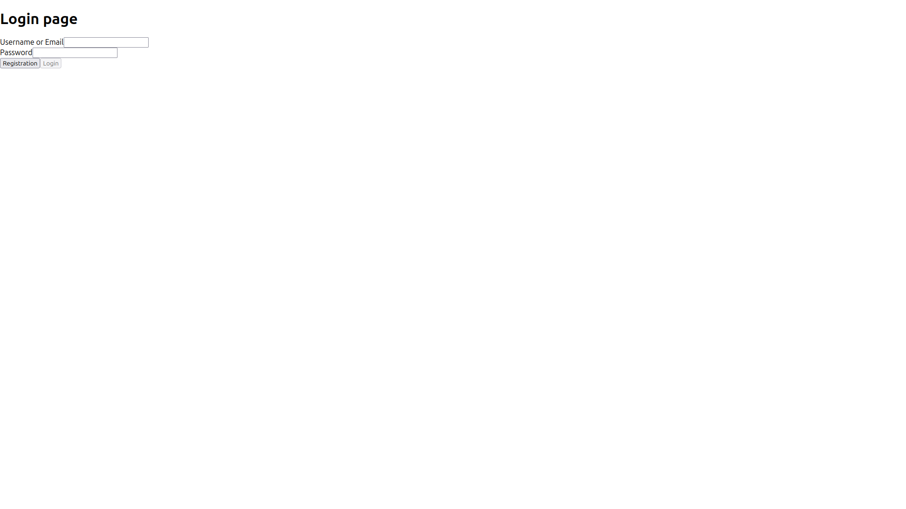
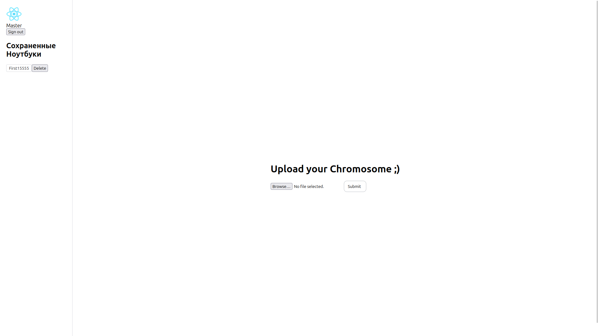
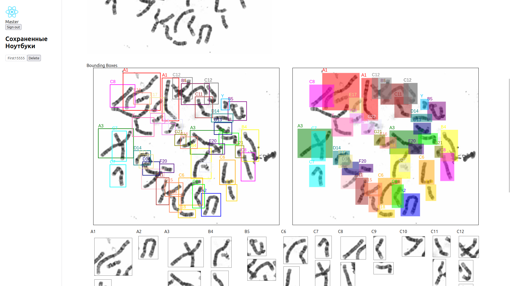
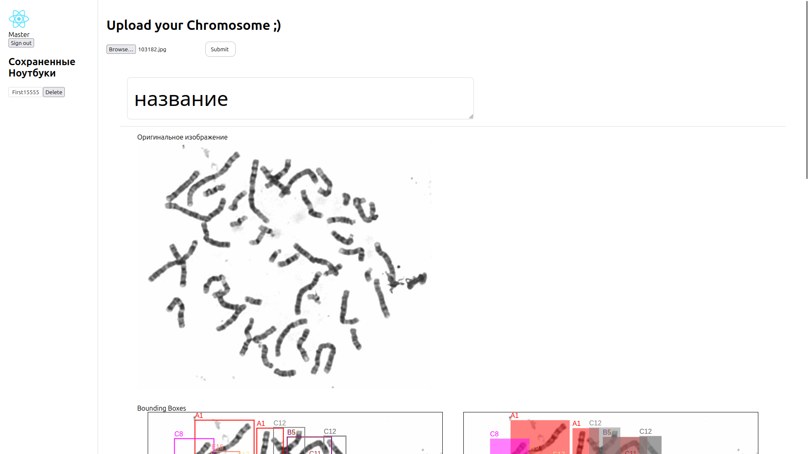
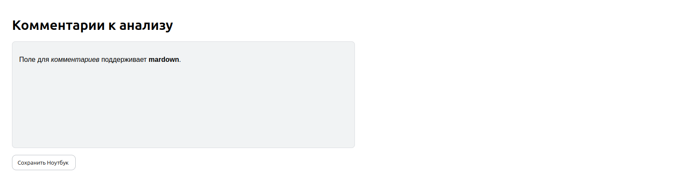
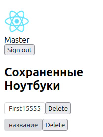
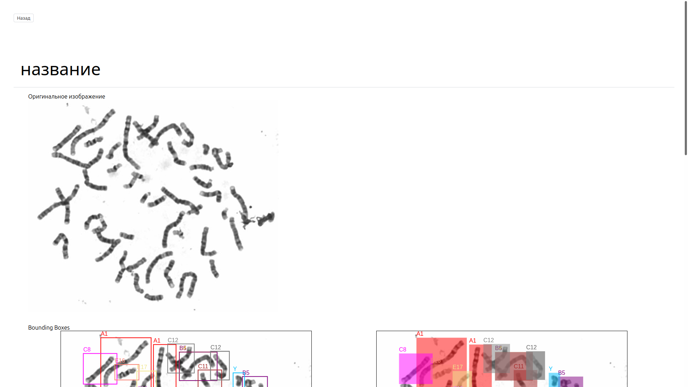
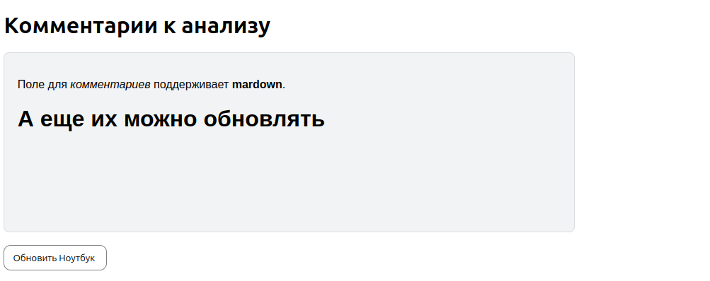

# Интерфейс
## Логин

На стартовой странице необходимо либо залогиниться, либо создать аккаунь перейдя на соответвующую страницу, нажав на кнопку **Registration**.
## Главная страница

На главной странице пользователь может загрузить свое изображение и получить предсказания, нажав кнопку **Submit**. Ограничений на размер и формат изображения **нет**. После вывода результатов компонент для загрузки изображений перемещается вверх и располагается над ноутбуком.
 ## Вывод результатов
 
 Нейросеть выделяет 80-90% хромосом. На строне клиента предсказания выводятся в виде фотографий с выделенными bounding boxes и фреймами с хромосомами, отсортированными по классам.

 Пользователь может указать название своего ноутбука и оставить комментарии в выделенном поле ввода. Поле для _комментариев_ поддерживает **Markdown**.
 
 
 Кнопка "Сохранить ноутбук" сохраняет результаты в БД. Ноутбуки пользователя отображаются в боковой панели слева. Их можно отдельно просмотреть, обновить или удалить.

 
 
 

 ## Что делать, если какой-то элемент не загрузился?
 Просто обновить страничку 😊